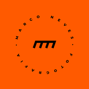
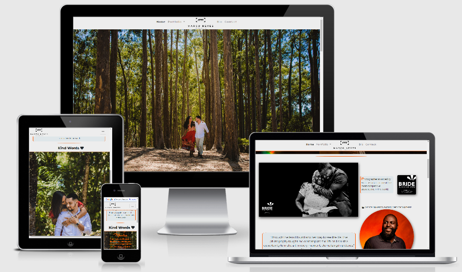

# Marco Neves Photography
---

Welcome,

Marco Neves is a Photographer with focus on weddings, couples and families photography. What does his job required is the necessity of eternalize unique, happy and very important moments of the life, but as important as this is show his job and art to the world, there is no better way to do this than having his own website to show his portfolio.

[Click here to see the project live](https://www.marconevesfotografia.com)

## UX
---
### The purpose of the website is to present the follow values:
  * Introduce who is Marco Neves Photography and his job, so that the client can become familiar.

  * Show his portfolio, making his job seem credible by creating a simple and professional desing, so that the client can become confident.
  * Make sure that there is a easy and quickly way to reach the **contact page**, to potentially increase the client base.
  * Create a resposive design, wich works in different screen sizes and devices, due the fact that people use more mobile devices nowadays.

### User Stories:
  1. I am a bride who wants to record each moment of my wedding. I need to be convinced that the photographer is professional and I also want to navigate through the website easily, because I have plenty of things to deal during the organization of my wedding and I can't waste time.

  2. We are a couple who wants a photographer to record our pre-wedding. we are looking for a photographer with authentic ideas and the website design would be like a business card, showing the style of the photographer work.

  3. I am a pregnant who wants to have some photos of the final stage of my pregnancy and I am looking for a good professional by my phone, I expect to have a good experience on this device.

### Design Process:
  * I began the design process by outlining the key features that I wanted my website to have and thought about what might be the most intuitive way to navigate through each page. This led me to decide on the four pages I would have on my website: 'Home', 'Portfolio', 'Bio' and 'Contact Us'.

  * In the same way, I decided to fix the navigation bar in the top of the page while the user scroll and navigate through the page, to keep a easy way to reach the another page, mainly the contact page.

  * I decided to build the 'Portfolio' as a dropdown menu, bringing different options like 'Weddings', 'pre-weddings' and 'family photos', each of these options redirect to another page with the same names as the options. Inside each of these pages there are different image links that redirect to an album.

  * I decided to apply breadcrumbs in the album pages to provide an easily navigation, the breadcrumb link go exactly to the point where the user was in the page before click in the link. 

  * After receive the visual identity from the client I decided the body color would be a "shade of white", with details in orange and letter color in black, and using the Montserrat font for general content, Montserrat font in bolder weight for headings and the Arizonia font for signatures and some headings, Following The instructions from the visual identity. The style guide can be seen here: [Style Guide](assets/files/style_guide.pdf) 

  * The layout changes in different screen sizes, I chose for take out some content in smaller screens to the content fits well in theses smaller screens, but the main content still in the website, and I changed The rows and columns arrangement to fit the content well.

### Wireframing my project on Balsamiq

  * The wireframe can be seen here: [Wireframe](assets/files/marco_neves_photography.pdf)

---
## Features
### Existing Features

This project has, at least, seven separate pages, the six main pages can be found by clicking on the corresponding name on the menu, the other pages are the albums and its quantity depends on how many album events would be plubished.

#### Consistent features across all pages

  * A navigation bar on the top of each page with The brand logo on the middle (which leads a user back to 'Home' when clicked) and two links, one to home page, and another Portfolio dropdown menu (with links to Wedding page portfolio, Pre-Wedding page portfolio and Family Photos page portfolio) on the left and two links on the right, one to Bio page, and another to Contact page. When in medium and small screens the navigation bar changes, the logo goes to the left side and the menu to the right side in a collpased form.

  * The footer is also consistent across all pages with links to social media profiles there, copyrights and a translation option.

#### Home page

  * The hero Image is a carousel with three photos.

  * There are three photo links that go to pre-wedding, wedding and family photos portfolio, each photo there is a zoom effect when is hovered.

  * The testimonial section called "Kind words" in small screens is a carousel with the photos, quotes and names.

  * Instagram section with the latest photos published on instagram profile brand, with likes quantity, comments, descriptions and link to instagram profile.

#### Album collection pages (Wedding portfolio, Pre-Wedding portfolio, Family photos portfolio)

  * There are photo links that go to event photo album, each photo link shows the event name, a comment, the event date and the event location when hovered.

#### Bio page

  * There is an overview about the brand and its beliefs.

#### Contact page

  * There is a fixed hero image.

  * There is a contact form to prospect the main informations about the costumer.

### Future Features

  * Add a blog page to allows more engagement between the brand and the costumers.

  * Build a working form without third parties platforms.

  * Add a robust validation form.

  * Improve the how the google translation API works on this website.

---
## Technologies Used

  * [HTML 5](https://en.wikipedia.org/wiki/HTML5)
    * The language used to build the structure and add its content.

  * [CSS3](https://en.wikipedia.org/wiki/CSS)
    * The language used to style the HTML5 elements according to the design and color scheme.

  * [Bootstrap framework](https://getbootstrap.com/)
    * I decided to use Bootstrap's grid container system as I wanted to design my project with a 'mobile first' approach, but another bootstrap resources were used like the contact form.

  * [Balsamiq](https://balsamiq.com/)
    * Balsamiq helped me crystalise my design ideas, creating the layout structure.

  * [FontAwesome](https://fontawesome.com/)
    * FontAwesome icons is where I got most part of the icons for my design project.

  * [Icons8](https://icons8.com/)
    * Icons8 is where I got two icons for the language option flags on footer.

  * [Google Fonts](https://fonts.google.com/)
    * I used Google fonts to provide the fonts of the website.

  * [Google translation API](https://cloud.google.com/translate/)
    * I used to provide the translation of the pages.

  * [Chrome Dev Tools](https://developers.google.com/web/tools/chrome-devtools)
    * A set of web developer tools built directly into the Google Chrome browser. I used these tools constantly thoughout the development cycle.

  * [ElfSight](https://elfsight.com/)
    * I used an ElfSight plugin to provide the instagram section on home page.

  * [Mike tricking](https://miketricking.github.io/bootstrap-image-hover/)
    * I used an Mike Tricking hover effect on portfolio pages.

  * [Netlify](https://docs.netlify.com/forms/setup/)
    * Netlify comes with built-in form handling that’s enabled by default. so there’s no need for you to make an API call or include extra JavaScript on your site. So there’s no need for you to make an API call or include extra script on your site. It can be used to host the website as well.
  
  * [GitHub](https://github.com/)
    * A company that provides hosting for software development version control using Git.

  * [Gitpod](https://gitpod.io/)
    * Gitpod is an open source platform for automated and ready-to-code development environments that blends into your existing workflow directly from your browser.

  * [Visual Code Studio](https://code.visualstudio.com/)
    * Is a programming code editor created by Microsoft that I used extensively. It allows programmers to create, save and edit their code on their own pc's.

  * [Code Institute Full Template](https://github.com/Code-Institute-Org/gitpod-full-template)
    * I used as a basic template to kick start my project.

  * [Canva](https://www.canva.com/)
    * I used the Canva platform to make the style guide.

  * [TinyPNG](https://tinypng.com/)
    * I used TinyPNG to compress my image files to try to reduce the loading time for each page.

  * [W3C markup validation service](https://validator.w3.org/)
    * Great tool to support throught the web development that helps to test and find issues on markup file.

  * [CSS validation service](https://jigsaw.w3.org/css-validator/)
    * Great tool to support throught the web development that helps to test and find issues on style file.

  * [W3C Schools](https://www.w3schools.com/)
    * W3C Schools is a great platform that covers all aspects of web development, great tools that provides information for developers.

  * [Stack Overflow](https://stackoverflow.com/)
    * Although it isn't a technology, I found a lot of guidance on Stack Overflow.

  * [MND Web Docs](https://developer.mozilla.org/en-US/docs/Web)
    * DN Web Docs, previously Mozilla Developer Network and formerly Mozilla Developer Center, is a documentation repository for web developers used by Mozilla, Microsoft, Google, and Samsung.

  * [CSS-tricks](https://css-tricks.com/)
    * Is a blog where you can find lots of tutorial and tricks to write a good css.

---
## Testing

### Testing User Stories

Based on the User Stories listed above:

  1. The bride was convinced that the photographer is a reliable photographer and he will register her wedding with quality and creativity, she had a good experience on website where she found every information quickly.

  2. the couple enjoyed the website design, making them confident that the photographer is creative and confirming this looking the photos on pre-wedding portfolio. 

  3. The pregnant liked the family portfolio, making her confident, she was capable to reach all website features by her smartphone.

### Validating The HTML and CSS code
  
  * [HTML](https://validator.w3.org/)
  * [CSS](https://jigsaw.w3.org/css-validator/)

### Testing in different browsers

I manually tested the website on the following web browsers, checking that buttons, responsiveness and design worked as planned:

  * Google Chrome
  * Mozilla Firefox

### Testing responsiveness

I manually tested the live project by doing the following:
  
  * Using Google Developer Tools to view the project on devices with different screen sizes.
  * Asking for feedback from friends and family who opened and interacted with the project on their devices.

### Issues found

  1. I planned to open each photo on portfolios pages in a modal, I implemented the modal with a carousel, but when I click on any photo the modal opens always in the first photo in a carousel. I don't have yet the knowledge to fix it with JavaScript. All photos keep being shown in the modal carousel control. I will implement a function to to prevent this from happening in a similar situation.

  2. I noted that the Mozilla Firefox render the photos better than the Google Chrome. I don't have yet the knowledge to fix it.

---
## Deployment

### Deploying my project

I created my project on GitHub and used GitPod's development environment to write my code.

To make my project viewable to others, I deployed my project to GitHub Pages with the following process:

  1. On [Netlify](https://www.netlify.com/) website, you click "Sign up";
  2. During the sign up process you will be asked to fork your account with your GitHub repository, then allow;
  3. On your dashboard click on the button "New site from git";
  4. Choose GitHub as provider;
  5. Choose a repository;
  6. And deploy

Use the following link to view my live project: [Marco Neves Photography](https://www.marconevesfotografia.com)

More information about this process can be found on the following link: [Netlify Docs](https://www.netlify.com/blog/2016/09/29/a-step-by-step-guide-deploying-on-netlify/)

## Cloning my project

If you would like to work on my project further you can clone it to your local machine using the following steps:

  1. Scroll to the top of my repository and click on the "clone or download button"
  2. Decide whether you want to clone the project using HTTPS or an SSH key and do the following:
    * HTTPS: click on the checklist icon to the right of the URL
    * SSH key: first click on 'Use SSH' then click on the same icon as above
  3. Open the 'Terminal'
  4. Change the current working directory to the location where you want the cloned directory
  5. Type 'git clone', and then paste the URL you copied earlier.
  6. Press 'Enter' to create your local clone.

You can find both the source of this information and learn more about the process on the following link: [Cloning a Repository](https://docs.github.com/en/github/creating-cloning-and-archiving-repositories/cloning-a-repository)

---
## Credits

### Content

The content of this website is entirely real developed by myself, designed by myself and [Marco Neves Photography](https://www.instagram.com/marconevesfotografia/?hl=en). The images are from Marco Neves portfolio.

### Acknowledgements

Thank you to the following people who helped with support, inspiration and guidance at different stages in the project:

  * My mentor [Caleb Mbakwe](https://www.linkedin.com/in/calebmbakwe/?originalSubdomain=ng)
  * Code Institute Mentors and Tutors
  * Code Institute Student Care, which is always Kind
  * My class on slack
  * The supportive Code Institute community on Slack
  * My family and friends for their patience and honest critique throughout

